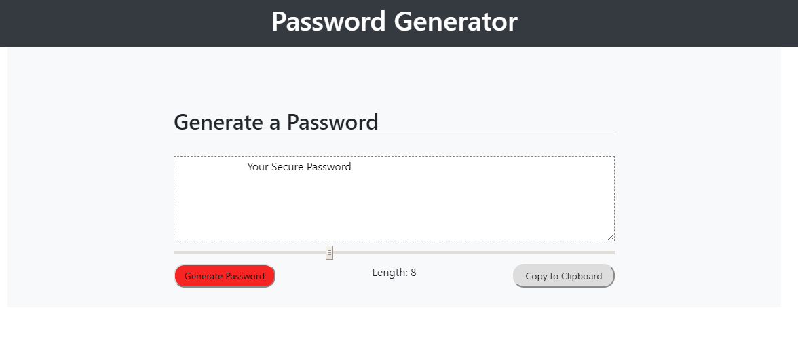

# Js-Password-Generator.github.io

This website is created for a coding bootcamp project at UT-Austin.

The website utilizes HTML, CSS, and JAVASCRIPT to generate a random password based on user-selected criteria.

It prompts the user to choose password with a criteria based on the length and character type.

After the inputs pass the validation, the app will present to the user a password matching his/her prompted answer.

At the end the user will have the option to copy the generated password to a clipboard.

Credit to websites that are used as a reference:

        w3ghost: How TO - Range Sliders

        https://www.youtube.com/watch?v=duNmhKgtcsI

        https://www.florin-pop.com/blog/2019/09/100-days-100-projects/

